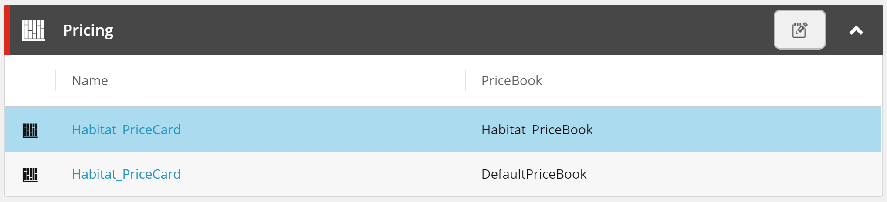

# Extended Sitecore Commerce Pricing
Custom Sitecore Commerce pricing plugin project with extended functionality for the Business Tools.

- [Supported Sitecore Experience Commerce Versions](#supported-sitecore-experience-commerce-versions)
- [Features](#features)
- [Enabling Features](#enabling-features)
- [Installation Instructions](#installation-instructions)
- [Known Issues](#known-issues)
- [Disclaimer](#disclaimer)

## Supported Sitecore Experience Commerce Versions
- [XC 9.3 (documentation here)](https://github.com/ajsuth/Ajsuth.Feature.Pricing.Engine/tree/release/9.3/master)
- [XC 10.0 (documentation here)](https://github.com/ajsuth/Ajsuth.Feature.Pricing.Engine/tree/release/10.0/master)

## Features
- [Price Book Price Card Links from Sellable Item and Variant Page Views](#price-book-price-card-links-from-sellable-item-and-variant-page-views)

### Price Book Price Card Links from Sellable Item and Variant Page Views
Updates the Pricing entity view to include price book links to the selected price card for all price books. If the price card does not exist in a price book, the price book entry is not rendered.

**Enablement Policy Property:** PricingFromProductView



_Sellable Item entity view._

## Enabling Features
In the environment configuration files, add the **PricingFeatureEnablementPolicy** and set the desired features to `true`. (See the **Enablement Policy Property** value under each feature). For example:
```javascript
{
	"$type": "Ajsuth.Feature.Pricing.Engine.Policies.PricingFeatureEnablementPolicy, Ajsuth.Feature.Pricing.Engine",
	"PricingFromProductView": true
}
```

## Installation Instructions
1. Download the repository.
2. Add the **Ajsuth.Feature.Pricing.Engine.csproj** to the _**Sitecore Commerce Engine**_ solution.
3. In the _**Sitecore Commerce Engine**_ project, add a reference to the **Ajsuth.Feature.Pricing.Engine** project.
4. Enable desired features, following [Enabling Features](#enabling-features).
5. Run the _**Sitecore Commerce Engine**_ from Visual Studio or deploy the solution and run from IIS.
6. Run the **Bootstrap** command on the _**Sitecore Commerce Engine**_.
7. Restart all Commerce Engine instances.

## Known Issues
| Feature                 | Description | Issue |
| ----------------------- | ----------- | ----- |
|                         |             |       |

## Disclaimer
The code provided in this repository is sample code only. It is not intended for production usage and not endorsed by Sitecore.
Both Sitecore and the code author do not take responsibility for any issues caused as a result of using this code.
No guarantee or warranty is provided and code must be used at own risk.
